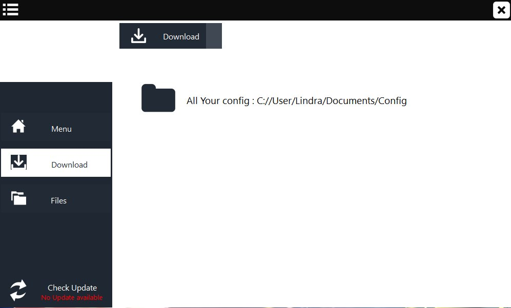
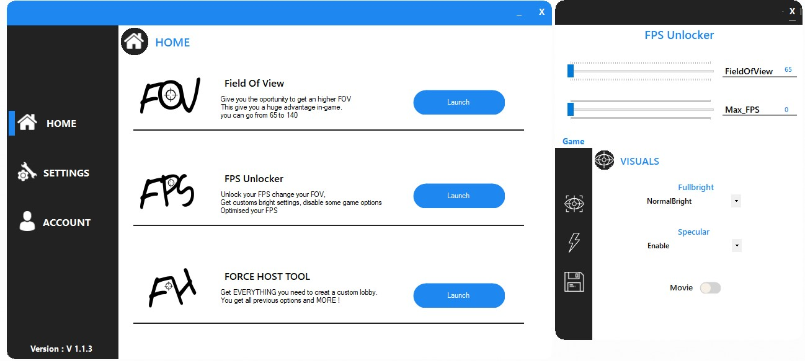
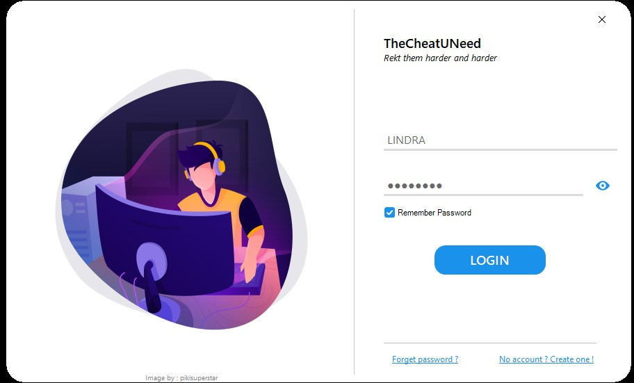
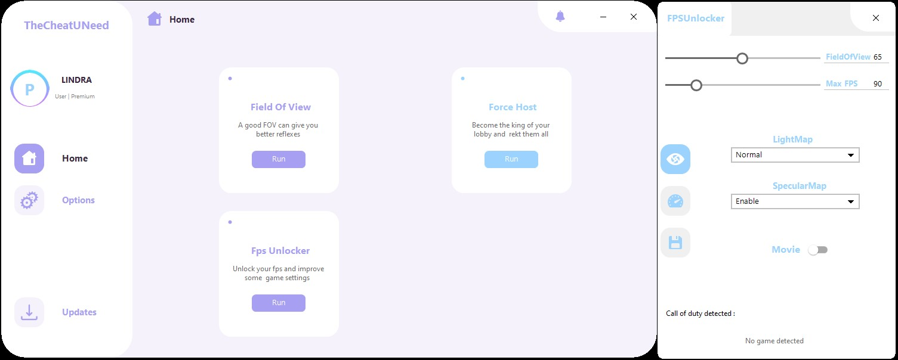
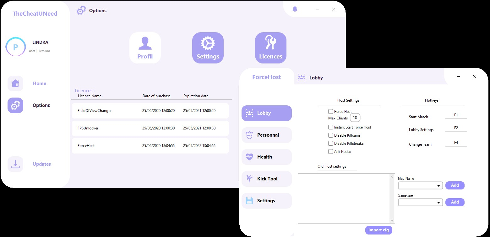

## CODEx history

## Introduction
First of all, you need to know that CODEx wasn't the original project at all :sweat_smile:
I wanted to create something bigger called **TCUN** (**T**he **C**heat **U** **N**eed), this project was suppose to let you use : 
- A FieldOfView changer
- A FPSUnlocker
- A Force Host

I spend 2 years designing & coding TCUN because I really wanted something beautifull and usefull at the same time, I actually create 3 versions of TCUN 

#### TCUN v1 (2018 - 2 years old)

#### TCUN v2 (2019 - 1 year old)

#### TCUN v3 (april 2020 - 6 months old)

- The v1 and v2 were three quarters finished (Menu, FOVChanger, FPSUnlocker, Loading settings, "update downloader")
- The v3 was fully finished & functionnal, with a login/register method. I also added licences key, and presents key (people will be able to join the beta version)  I also had created an updater which was closed to CODEx updater but I decided not to release this tool because I didn't want to pay a domain name for a website and an API that 2 budy will use.

Then a week ago, I decided to create the lastest tool I wanted to add to TCUN but doing it for the community, so I forced myself to work on it around 6hours per day in a week to release it and not giving up before my deadline.

## Why CODEx ?

There are 2 answers to the question :upside_down_face:
- First one is a bit obvious CODEx is for **C**all **o**f **D**uty **Ex**ternal Console :smile:
- Seconde one is for the [Codex](https://en.wikipedia.org/wiki/Codex) 

## Good coding practice

- I wanted to improve my skill at coding while doing this project.
- I documented most of my functions and methods so it will be easier for you to modify the existing
I tried to respect these principle : `KISS, SOLID`
- I tried my best not to create an application which require a database or API connection, that's why this app is linked to .md files (to check the version and download the updates) :sweat_smile:

I also tried to work with different type of file (ini, json, cfg)